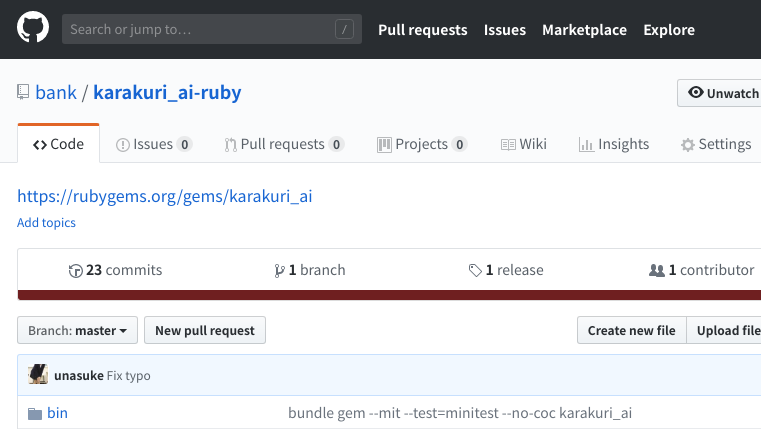
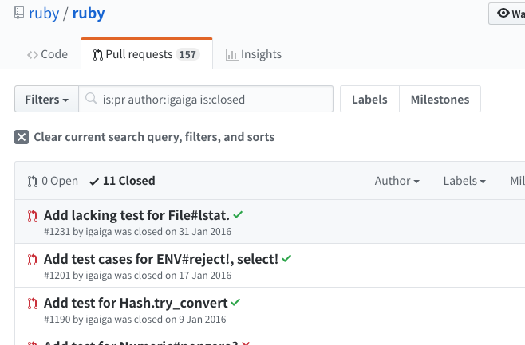

# Rubyにpatchを\\n送ってみよう！
subtitle
: 2018-07-29 at 株式会社VOYAGE GROUP

subtitle
: TokyuRuby会議12

author
: うなすけ

theme
: unasuke-white

# 自己紹介
- 名前 : うなすけ
- 所属 : 株式会社バンク (エンジニア)
  - インフラ寄りサーバーサイドエンジニア
- GitHub [@unasuke](https://github.com/unasuke)
- Twitter [@yu\_suke1994](https://twitter.com/yu_suke1994)
- Mastodon [@unasuke@mstdn.maud.io](https://mstdn.maud.io/@unasuke)

{:relative_width="24" align="right" relative_margin_right="-10" relative_margin_top="42"}

# 最近
{:relative_width="70"}

[寝転がったままパソコンを使う \| うなすけとあれこれ](https://blog.unasuke.com/2018/use-computer-on-the-bed/)

# tqrk12
{:relative_width="90"}

# tqrk12
{:relative_width="90"}


# はい
- はい

# Rubyにpatchを送る
- どうやって？
  - SVNわかんない……
  - C言語わかんない……
- そもそも送るネタがない
  - 私に直せるバグなんてある？
  - 新機能なんて思いつかないし……

# Rubyにpatchを送る
- どうやって？
  - SVNわかんない…… ←それな
  - C言語わかんない…… ←それな
- そもそも送るネタがない
  - 私に直せるバグなんてある？ ←それな
  - 新機能なんて思いつかないし…… ←それな

# Rubyにpatchを送った

{:.center}
{::tag name="x-large"}ぼくのばあい{:/tag}

# bank/karakuri_ai-ruby
{:relative_width="90"}


# bank/karakuri_ai-ruby's gemspec

```ruby
spec.add_development_dependency "bundler", "~> 1.16"
spec.add_development_dependency "rake", "~> 10.0"
spec.add_development_dependency "minitest", "~> 5.0"
spec.add_development_dependency "webmock"
```

[karakuri_ai-ruby/karakuri_ai.gemspec at master · bank/karakuri_ai-ruby · GitHub](https://github.com/bank/karakuri_ai-ruby/blob/a6462b888882693bc6123add5fc2d8d815fd6a02/karakuri_ai.gemspec#L24-L27)

- runtime_dependencyがない！
  - 標準ライブラリのみを使用している

# net/http のみで実装するAPI Client Gem
- 動機
  - 無駄に依存を増やしたくない
    - Faraday
    - httparty
    - etc...
    - [https://postd.cc/kill-your-dependencies/](https://postd.cc/kill-your-dependencies/)
  - 標準ライブラリのお勉強

# net/http のみで実装するAPI Client Gem
- 機能
  - 認証
  - JSONをPOROにmapping
  - エラーが返ってきたら例外 ← ここ

# Net::HTTPResponse#value
[class Net::HTTPResponse (Ruby 2.5.0)](https://docs.ruby-lang.org/ja/2.5.0/class/Net=3a=3aHTTPResponse.html#I_VALUE)

> レスポンスが 2xx(成功)でなかった場合に、対応する 例外を発生させます。

オッ、便利か〜〜？？？


# Net::HTTPResponse#value
[class Net::HTTPResponse (Ruby 2.5.0)](https://docs.ruby-lang.org/ja/2.5.0/class/Net=3a=3aHTTPResponse.html#I_VALUE)


> [EXCEPTION] HTTPServerException:
>      レスポンスが 4xx である場合に発生します。

{::tag name="x-large"}🤔🤔🤔🤔🤔🤔🤔🤔🤔🤔🤔🤔{:/tag}

# HTTP status code
> The 4xx class of status code is intended for cases in which the client seems to have erred.The 4xx class of status code is intended for cases in which the client seems to have erred.

[https://www.w3.org/Protocols/rfc2616/rfc2616-sec10.html](https://www.w3.org/Protocols/rfc2616/rfc2616-sec10.html)

400系はクライアントが悪い場合……だよね？

# Net::HTTPResponse#value
[class Net::HTTPResponse (Ruby 2.5.0)](https://docs.ruby-lang.org/ja/2.5.0/class/Net=3a=3aHTTPResponse.html#I_VALUE)


> [EXCEPTION] HTTPServerException:
>      レスポンスが 4xx である場合に発生します。

- 間違ってるのはどっち？
  - Ruby Net::HTTPResponse#value
  - 俺

# 困ったときの
{:relative_width="80"}

# 困ったときの Asakusa.rb
usa-san says...

> これは仕様のバグですね


- 間違ってるのはどっち？
  - Ruby Net::HTTPResponse#value ← こっち
  - 俺

# なおす
- なおす
  - SVNわかんない……
  - C言語わかんない……

# なおす
- なおす
  - SVNわかんない……
    - 使うのはgitだけ
  - C言語わかんない……
    - (今回)書くのはRuby

やっていきましょう

# なおし手順
1. cloneする
1. grepする
1. みつける
1. 書き換える
1. testを回す
1. bugs.ruby-lang.orgに投稿
1. 待つ

# なおし手順 - cloneする
- git cloneでダイジョウブ
  - `https://github.com/ruby/ruby.git` ← オススメ
  - `https://git.ruby-lang.org/ruby.git`

# なおし手順 - grepする
```shell
$ git grep HTTPServerException
```

`lib/net/http/exceptions.rb` が怪しい！

```ruby
# lib/net/http/exceptions.rb
module Net::HTTPExceptions
  def initialize(msg, res)   #:nodoc:
    super msg
    @response = res
  end
  attr_reader :response
  alias data response    #:nodoc: obsolete
end
### snip ###
```

# なおし手順 - みつける
```ruby
class Net::HTTPServerException < Net::ProtoServerError
  # We cannot use the name "HTTPServerError", it is the name of the response.
  include Net::HTTPExceptions
end
```
[https://github.com/ruby/ruby/blob/v2_5_1/lib/net/http/exceptions.rb#l19-l22](https://github.com/ruby/ruby/blob/v2_5_1/lib/net/http/exceptions.rb#l19-l22)

ここだ〜〜〜〜

# なおし手順 - 書き換える
- 単純に名前を換えるのヤバそう
  - この例外の名前を使ってるコードがぶっ壊れ
  - `alias` という便利機能があるっぽい
    - [https://docs.ruby-lang.org/ja/latest/doc/spec=2fdef.html#alias](https://docs.ruby-lang.org/ja/latest/doc/spec=2fdef.html#alias)
    - Rubyってすごいな〜〜

# なおし手順 - 書き換える
しかしこういうことはできない！

```ruby
alias Net::NiceExceptionName Net::HTTPServerException
```

これならできる

```ruby
module Net
  alias NiceExceptionName HTTPServerException
end
```

# なおし手順 - 書き換える
結局こうした

```ruby
# for compatibility
Net::HTTPClientException = Net::HTTPServerException
```

{::tag name="x-small"}usaさんが代入すればいい的なことをおっしゃってたので……{:/tag}

# なおし手順 - testを回す
- 変更してtestが通るか確認
  - `make check`
  - なんならテストも書き換える

```diff
# test/net/http/test_httpresponse.rb
     res = Net::HTTPResponse.read_new(io)
     assert_equal(nil, res.message)
-    assert_raise Net::HTTPServerException do
+    assert_raise Net::HTTPClientException do
       res.error!
     end
   end
```

# なおし手順 - bugs.ruby-lang.orgに投稿
1. ユーザー登録する
1. チケット → 「新しいチケット」をクリック
1. 思いの丈をぶつける

[Feature #14688: Net::HTTPResponse#value raises "Net::HTTPServerException" in 4xx response - Ruby trunk - Ruby Issue Tracking System](https://bugs.ruby-lang.org/issues/14688)


# なおし手順 - 待つ
- open 04/15 → close 06/06
  - 約2ヶ月
  - きっかけはnaruseさんに直に相談
    - 「会える」は強い
  - みんな暇じゃない

# my patch approved!
{:relative_width="90"}

# Rubyにpatchを送る
- どうやって？
  - SVNわかんない……
    - 使うのはgitだけ
  - C言語わかんない……
    - 領域による

# Rubyにpatchを送る
- そもそも送るネタがない
  - 私に直せるバグなんてある？
  - 新機能なんて思いつかないし……


# Rubyにpatchを送る
{:relative_width="60"}

[https://twitter.com/mametter/status/1022848181590052864](https://twitter.com/mametter/status/1022848181590052864)

# Rubyにpatchを送る
> テストやリファクタリングを頑張るコミッタはあんまいない


# Rubyにpatchを送る
{:relative_width="90"}

# Rubyにpatchを送る
- そもそも送るネタがない
  - 私に直せるバグなんてある？
    - 不足しているテストを書くとよさそう
  - 新機能なんて思いつかないし……
    - (今)思いつかなくてもいいのでは
    - あせらない、あせらない

# Ruby communityにpatchを送る
- ruby/rubyだけがRubyじゃない

> 「Rubyist」という言葉は造語で、Rubyに対して単なるお客さん以上の気持を持っている人がRubyistです。

- rurema/doctree
- rubima/magazine.rubyist.net
- many rubygems...

# まとめ
- Ruby 2.6には僕のpatchが含まれてます
- Rubyにpatchを送るには
  - gitの知識で十分
  - GitHubにpull requestを送るのでもOK
- We are Rubyist!
